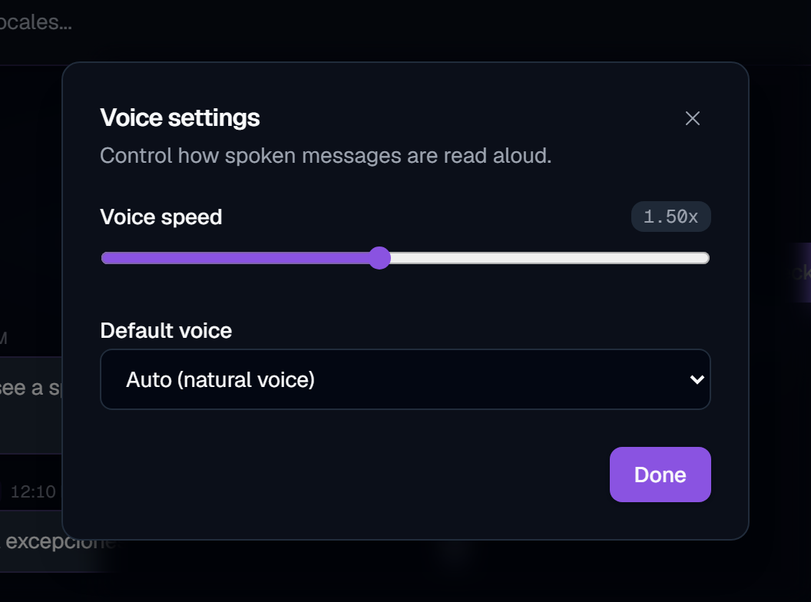
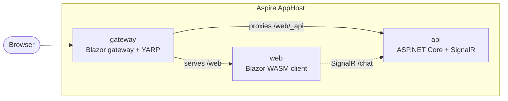

# SignalR: Chat (Advanced)

[](https://github.com/IEvangelist/signalr-chat/actions/workflows/blazing-chat.yml)

A real-time chat sample built on **ASP.NET Core SignalR** and **Blazor WebAssembly**, running on **.NET 10** and orchestrated with **.NET Aspire**. Messages are broadcast live to everyone in the room, joke chatbots can be commanded inline, and replies can be translated and spoken aloud.

The UI is a **shadcn-inspired design system** built with **Tailwind CSS v4**: dark-mode first with a light option, a violet→fuchsia→indigo brand gradient over zinc neutrals, an animated aurora backdrop, gradient message bubbles and avatars, a persistent live-connection status pill, an emoji composer, and a voice-settings dialog that prefers natural (non-robotic) voices.

## Demos

> Short, silent screen recordings — press ▶ to play.

### Real-time chat with the inline joke bot

Messages broadcast live over SignalR, with the `joke:dad` bot replying in real time.

<video src="https://github.com/IEvangelist/signalr-chat/raw/main/media/demo-chat.mp4" controls muted width="100%"></video>

### Motion, texture, and theming

Cursor-reactive spotlight highlights, spring motion, and one-click dark/light theming.

<video src="https://github.com/IEvangelist/signalr-chat/raw/main/media/demo-motion.mp4" controls muted width="100%"></video>

### Natural voice replies

Spoken replies default to a natural (non-robotic) voice, with an adjustable playback speed.

<video src="https://github.com/IEvangelist/signalr-chat/raw/main/media/demo-voice.mp4" controls muted width="100%"></video>

## Screenshots

> These images are theme-aware — GitHub shows the dark or light capture to match your current theme.

### Sign-in landing


### Live chat with joke bots and inline translation

The Chuck Norris joke below was requested with `joke:chucknorris:es` and translated to Spanish on the fly.


### Voice settings

Spoken replies default to a natural (non-robotic) voice, with an adjustable playback speed.



## Architecture

This solution is a distributed Aspire application. The AppHost orchestrates the resources, and a Blazor gateway serves the WebAssembly client and fronts the backend API.



| Project | Resource | Role |
|---------|----------|------|
| `BlazingChatter.AppHost` | (host) | Aspire orchestration and the Blazor gateway |
| `BlazingChatter.Server` | `api` | Minimal API, the `/chat` SignalR hub, joke bots, translation |
| `BlazingChatter.Client` | `web` | Standalone Blazor WebAssembly client (Tailwind UI) |
| `BlazingChatter.ServiceDefaults` | (shared) | OpenTelemetry, health checks, service discovery defaults |
| `BlazingChatter.Shared` | (shared) | Message contracts shared by client and server |

The gateway serves the client under the `/web` path prefix. The client resolves the API base at startup from the gateway's per-app configuration endpoint and connects the SignalR hub to `{apiBase}/chat`.

## Prerequisites

- [.NET 10 SDK](https://dotnet.microsoft.com/download/dotnet/10.0) (10.0.300 or newer; pinned in `global.json`)
- [Node.js](https://nodejs.org) 20 or newer (used by the client's MSBuild target to compile Tailwind CSS)
- [Aspire CLI](https://aspire.dev) (`dotnet tool install -g aspire.cli --prerelease`)

## Run locally

From the AppHost directory:

```bash
cd BlazingChatter/AppHost
aspire run
```

The CLI prints a dashboard URL and the gateway endpoint. Open the gateway URL (it ends in `/web`) to use the app. If you run over plain HTTP, set `ASPIRE_ALLOW_UNSECURED_TRANSPORT=true` first.

You can also launch the AppHost directly with `dotnet run` from `BlazingChatter/AppHost`.

## Frontend / Tailwind

The client styles live in `BlazingChatter/Client/Styles/app.tailwind.css` and compile to `wwwroot/css/app.css`. A `dotnet build` of the client runs the Tailwind CLI automatically (via the `BuildTailwindCss` MSBuild target), so no manual step is needed.

For fast iteration on styles while the app is running:

```bash
cd BlazingChatter/Client
npm install
npm run watch:css
```

To build without Node available (using the committed `app.css`), pass `-p:RunTailwind=false` to `dotnet build`.

## Configuration and secrets

### Translation

Localized jokes (e.g. `jokes:chucknorris:bg`) work **out of the box** — no key or setup required. By default the `api` project translates via the free, key-less [MyMemory](https://mymemory.translated.net/doc/spec.php) API. If translation ever fails, the joke is still delivered in its original English.

For higher quality and quota, you can optionally switch to **Azure AI Translator**. Create a Translator resource ([free tier available](https://learn.microsoft.com/azure/ai-services/translator/create-translator-resource)) and supply these settings to the **`api`** project (`BlazingChatter.Server`), either as environment variables or user secrets. When both an endpoint and key are present, Azure is used automatically:

| Name | Value |
|------|-------|
| `TranslateTextOptions__ApiKey` | Your Translator resource key |
| `TranslateTextOptions__Endpoint` | `https://api.cognitive.microsofttranslator.com/` |
| `TranslateTextOptions__Region` | Your Translator resource region |

```bash
cd BlazingChatter/Server
dotnet user-secrets set "TranslateTextOptions:ApiKey" "<your-key>"
dotnet user-secrets set "TranslateTextOptions:Endpoint" "https://api.cognitive.microsofttranslator.com/"
dotnet user-secrets set "TranslateTextOptions:Region" "<your-region>"
```

### Authentication (Keycloak)

Sign-in uses **Keycloak** (OpenID Connect + PKCE), run as a container and orchestrated by the AppHost. On startup the AppHost imports the `blazingchatter` realm from `BlazingChatter/AppHost/Realms/blazingchatter-realm.json`, which provisions:

- A public PKCE SPA client, `blazingchatter-web`, with redirect/web-origin URIs for the gateway (`https://localhost:7443/web/*`).
- An audience mapper that stamps `blazingchatter-api` into access tokens so the `api` project can validate them.
- A ready-to-use development user:

  | Username | Password |
  |----------|----------|
  | `tester` | `Password123!` |

No external tenant or secret is required for local development — `aspire run` starts Keycloak, imports the realm, and wires the `web` and `api` projects to it automatically. The client's OIDC authority and the API's token-validation settings live in each project's `appsettings.json`; point them at your own Keycloak realm to use a different identity provider.

Because the client is served under `/web`, the OIDC redirect URI is:

```
{origin}/web/authentication/login-callback
```

That reply URL is already registered in the imported realm.

## Using the chat

Type a message and press Enter to broadcast it live. Command the joke bots inline:

```
(joke|jokes)[:dad|chucknorris][:en (or another two-letter locale, e.g. bg)]
```

- `joke` tells a single Dad joke in English.
- `jokes:chucknorris:bg` starts the Chuck Norris bot telling jokes continuously in Bulgarian.
- `stop` issues a global stop for the running bots.

## Deployment

The previous single-site Azure App Service deployment does not map 1:1 to the Aspire multi-resource model. The natural target is Azure Container Apps (or Docker Compose), published from the AppHost:

```bash
aspire publish BlazingChatter/AppHost -o ./artifacts
```

The CI `deploy` job is disabled pending a target decision. See `.github/workflows/blazing-chat.yml` for the wiring.
